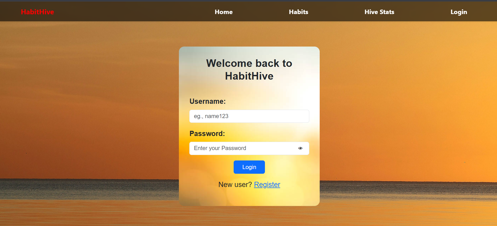
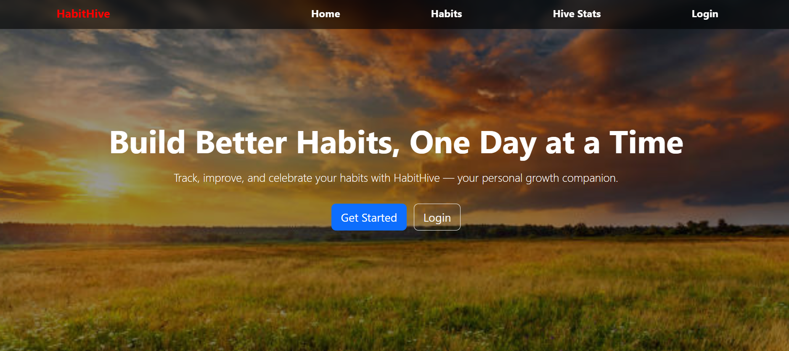
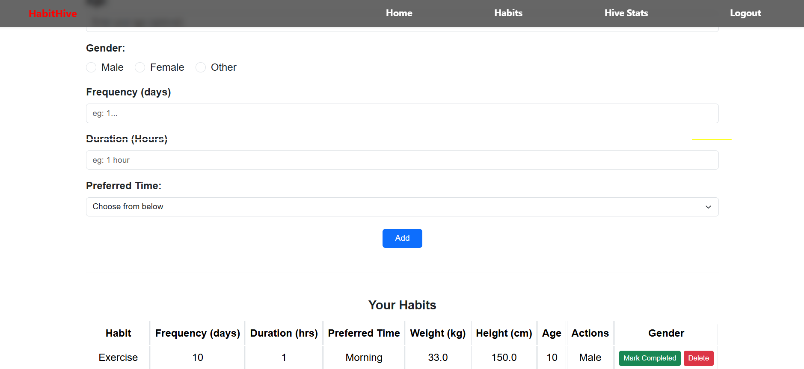
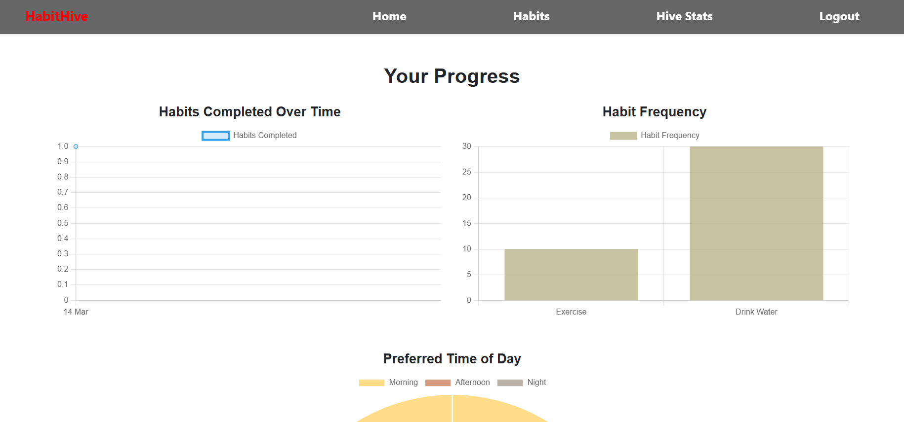

# HabitHive — Interactive Habit Tracking Platform


> A web-based habit tracking application that recommends habits based on BMI and age, tracks daily completions, and visualizes progress through interactive charts.

---

## Problem Statement

Most habit trackers treat all users the same. HabitHive takes a different approach — it uses the user's **weight, height, and age** to calculate BMI and recommend relevant habits automatically. Combined with daily completion tracking and visual stats, it gives users a personalized, data-driven habit-building experience.

---

## Features

| Feature | Description |
|---|---|
| Register / Login | Secure auth with Werkzeug password hashing |
| Personalized Habit Recommendations | Recommends habits based on BMI category (Underweight / Normal / Overweight / Obese) and age group (Teen / Young Adult / Adult / Senior) |
| Add Custom Habits | User types their own habit name or selects from a dropdown |
| Habit Configuration | Set frequency (days/week), duration (hours), and preferred time (Morning / Afternoon / Night) |
| Daily Completion Tracking | Mark habits complete per day — duplicate completions blocked server-side |
| Delete Habits | Remove habits and all associated completion records |
| Hive Stats Dashboard | Visual charts — daily completion trend, remaining habit targets per habit, preferred time distribution |
| Blog Section | 3 built-in articles on habit building, morning routines, and mindfulness with related article suggestions |
| Health Profile | User stores weight, height, age, gender — persisted on User model, updates on every habit form submit |

---

## Tech Stack

| Layer | Technology |
|---|---|
| Language | Python 3.x |
| Backend Framework | Flask |
| Frontend | Bootstrap 5, JavaScript, HTML, CSS |
| Database | PostgreSQL |
| ORM | Flask-SQLAlchemy |
| Authentication | Flask-Login + Werkzeug password hashing |
| Forms | Flask-WTF + WTForms |
| Charts | JavaScript (chart data passed from Flask via Jinja2) |

---

## Screenshots

### Login Page


### Dashboard


### Habits Page


### Habit_Stats Page


## Live Demo
[](https://habit-tracker-96vr.onrender.com)

## Project Structure

```
Habit Tracker/
│
├── Output_Screenshots/
├── app.py                  # Main Flask app — all routes and business logic
├── models.py               # User, Habit, HabitCompletion models
├── forms.py                # LoginForm, RegisterForm, HabitForm (Flask-WTF)
│
├── templates/
│   ├── dashboard.html      # Home page — articles feed
│   ├── login.html          # Login page
│   ├── register.html       # Registration page
│   ├── habit.html          # Add habits + BMI recommendations + habit list
│   ├── hive_stats.html     # Charts — completion trend, targets, time distribution
│   └── blog_detail.html    # Individual blog article with related articles
│
└── static/
|   ├── style.css
|   ├── script.js
|   └── images/
|       ├── login-img.jpg
|       └── sunset.jpg
|
├── .env
├── .gitignore
├── README.md
└── requirements.txt
```

---

## Database Schema

```
Users
──────────────────────────
id (PK)
username (unique)
password (hashed — Werkzeug)
date_created
weight (Float, nullable)
height (Float, nullable)
age (Integer, nullable)
gender (String, nullable)


Habits
──────────────────────────
id (PK)
user_id (FK → Users)
habit_name
frequency          ← target completions per duration window
duration           ← total habit duration in hours
preferred_time     ← Morning / Afternoon / Night
date_created


HabitCompletions
──────────────────────────
id (PK)
habit_id (FK → Habits)
date
completed (Boolean)
```

---

## BMI-Based Recommendation Logic

```python
# BMI Categories → Recommended Habits
Underweight (BMI < 18.5)  →  Strength Training, Balanced Meals
Normal (18.5–24.9)        →  No auto-recommendation
Overweight (25–29.9)      →  Cardio, Drink Water, Meditation
Obese (BMI ≥ 30)          →  Cardio, Drink Water, Meditation

# Age Categories → Recommended Habits
Child/Teen  (< 18)        →  Story Reading, Homework Routine
Adult       (18–55)       →  No auto-recommendation
Senior      (> 55)        →  Gentle Walk, Memory Games
```

Recommendations from both BMI and age are combined and displayed on the habit page.

---

## Hive Stats — Chart Data

The `/hive-stats` route computes and passes three datasets to the frontend:

| Chart | Data | Description |
|---|---|---|
| Daily Completion Trend | Date vs completion count | Shows which days had the most habit completions |
| Remaining Targets | Habit name vs remaining count | How many completions still needed before duration ends |
| Time Distribution | Morning / Afternoon / Night vs count | Which time slots have pending habits today |

---

## Routes

| Method | Route | Auth | Description |
|---|---|---|---|
| GET/POST | `/login` | Public | Login |
| GET/POST | `/register` | Public | Register |
| GET | `/` | Public | Dashboard — articles feed |
| GET | `/dashboard` | Public | Dashboard with current user context |
| GET/POST | `/habit` | Required | Add habits, view list, get BMI recommendations |
| POST | `/complete-habit/<id>` | Required | Mark habit complete for today (JSON API) |
| DELETE | `/delete-habit/<id>` | Required | Delete habit and all completions (JSON API) |
| GET | `/hive-stats` | Required | View completion charts |
| GET | `/blog/<id>` | Public | Read individual blog article |
| GET | `/logout` | Required | Logout |

---

## Getting Started

### Prerequisites

```bash
Python 3.8+
pip
Postgresql 17 or 18
```

### Installation

```bash
# Clone the repo
git clone https://github.com/navas-cloud/habithive.git
cd habithive/Habit Tracker

# Install dependencies
pip install -r requirements.txt
```

### Run the App

```bash
python app.py
```

Open **http://127.0.0.1:5000** in your browser. The database tables are auto-created on first run via `db.create_all()`.

---

## Key Engineering Decisions

- **Health profile stored on the User model** — weight, height, age, gender are first-class fields on `User`, not a separate table; habit recommendations compute directly from `current_user` attributes with no extra join
- **Server-side duplicate completion guard** — `/complete-habit` checks `HabitCompletion` for an existing entry with today's date before inserting; prevents double-counting without any client-side state
- **JSON API for complete and delete** — habit completion and deletion use `jsonify` responses consumed by JavaScript, keeping the habit page interactive without full page reloads
- **Remaining target calculation scoped to duration window** — stats correctly compute remaining completions only within the habit's active window (`date_created` to `date_created + duration days`), not lifetime totals
- **BMI + age recommendation as additive lists** — both BMI-based and age-based recommendations are computed independently and merged, so a Senior with Overweight BMI gets recommendations from both categories

---

## What I'd Improve Next
- [x] Deployed to Render
- [x] Migrated SQL Server to PostgreSQL for production
- [ ] Add streak tracking
- [ ] Write pytest unit tests for BMI logic and completion duplicate guard
- [ ] Dockerize with docker-compose for portable setup
- [ ] Deploy to AWS

---

## Authors

**MohammedNavas A**
[LinkedIn](https://linkedin.com/in/mohammed-navas-a-) · [GitHub](https://github.com/navas-cloud) · navash.a.v012@gmail.com

**Priyanka R P**
[LinkedIn](https://www.linkedin.com/in/priyanka-rp) · [GitHub](https://github.com/PriyankaRP17) · priyankapremnath17@gmail.com